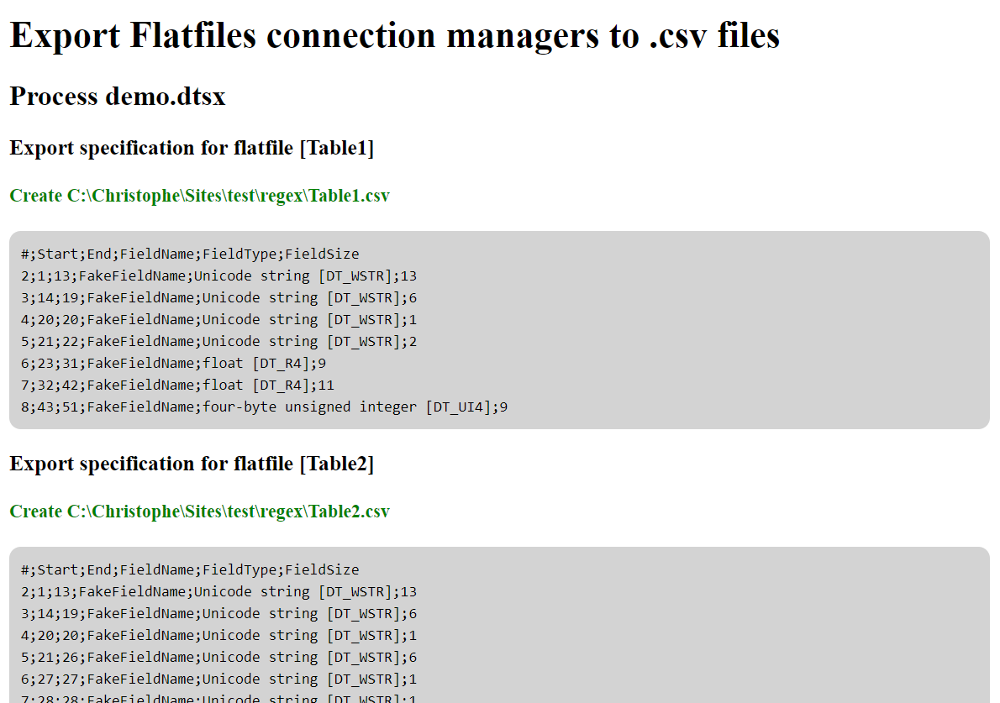

# SSIS Flatfiles export specifications to CSV


By **Christophe Avonture**

> Utility for reading `.dtsx` files created with Visual Studio, loop any flatfiles connection managers and export the specifications used for flatfiles to external `.csv` files

## Table of Contents

- [Description](#description)
- [Install](#install)
- [Usage](#usage)
- [License](#license)

## Description

When you need to import flatfiles into a SQL Server database, one way to do this is to create a SSIS package and to create one Flatfile connection manager for each file to import.

When the structure of the file to import is important, it's a pitty to maintain the description into your package and into your technical documentation since Visual Studio don't provide any feature to export your list (list of fields, their type and their size) into a text file.

**This PHP utility will do it for you**

The script will process any `.dtsx` files that you'll put in the same directory than the script, open the XML declaration of the file and process every flatfiles's description.

For each file defined in the `.dtsx` package, you'll get one `.csv` file.

Here is an example of the output generated by the script :

```csv
#;Start;End;FieldName;FieldType;FieldSize
2;1;13;FakeFieldName;Unicode string [DT_WSTR];13
3;14;19;FakeFieldName;Unicode string [DT_WSTR];6
4;20;20;FakeFieldName;Unicode string [DT_WSTR];1
5;21;22;FakeFieldName;Unicode string [DT_WSTR];2
6;23;31;FakeFieldName;float [DT_R4];9
7;32;42;FakeFieldName;float [DT_R4];11
8;43;51;FakeFieldName;four-byte unsigned integer [DT_UI4];9
```

_You can find more informations in the PHP source code, in the comments_

## Install

This script is intended to be used from a browser (you'll be able to use it as a CLI utility but then you'll need to modify it).

So, get a copy of this PHP script and put it in a webfolder (localhost or on the internet).

Put in the same folder one or more SSIS package file so, you'll have something like this :

```
/webfolder/
	index.php		'<-- this script
	package.dtsx	'<-- a package (you can have more than one)
```

If needed, create an alias in your Apache local webserver to the `/webfolder/` folder.

## Usage

Just start your browser and go to your URL like `http://localhost/ssis/index.php` (f.i. `ssis` is an alias to the `/webfolder/` folder).

The script will be started and will immediatly process any `.dtsx` files.

The result will be the creation of `.csv` files in the same folder : one `.csv` file by flatfiles connection manager found.



## Contribute

PRs not accepted. Just make a fork of this repository and update the script to fit your needs.

## License

[MIT](LICENSE)
